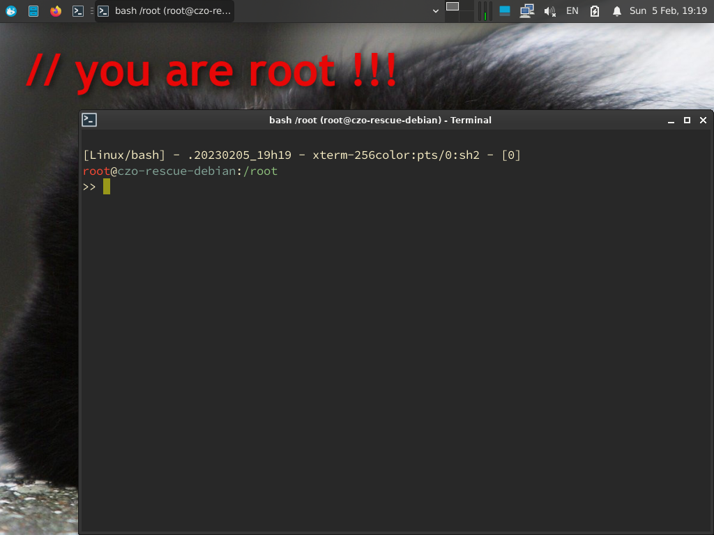

<!--
Filename: README.md
Author: Olivier Sirol <czo@free.fr>
License: GPL-2.0 (http://www.gnu.org/copyleft)
File Created: 30 December 2022
Last Modified: Saturday 25 February 2023, 10:59
Edit Time: 0:34:52
Description:

Copyright: (C) 2022, 2023 Olivier Sirol <czo@free.fr>
-->

# Czo Rescue Debian

A live [Linux Debian Rescue](https://gitlab.com/czo/czo-rescue-debian), which started from my own Linux Arch [SystemRescue fork](https://gitlab.com/czo/czo-system-rescue).

It's has zfs binaries + 3ware raid + my configuration files (.bashrc/.vimrc/.tmux.conf).

Xfce has its whisker menu and its xfce4-xkb plugin. There is also firefox-esr and firefox-ublock-origin.

Version 11.6-3 contains kernel/5.10.0-21-amd64 and zfs/2.0.3-9

## Project

* Source code: https://gitlab.com/czo/czo-rescue-debian

* ISO files: https://sourceforge.net/projects/czo-rescue-debian

## Building Czo-Rescue-Debian

Czo-Rescue-Debian can be built for x86_64 or i686 architectures. It must be built
on a debian11/amd64 if you want to build a 64bit edition, or a debian11/686
if you want to create a 32bit edition.

The following packages must be installed on the build system:

    apt install syslinux-efi grub-pc-bin grub-efi-amd64-bin grub-efi-ia32-bin debootstrap squashfs-tools xorriso isomd5sum isolinux mtools dosfstools bash coreutils

The build process can be started by running the `make-czo-rescue-debian-iso` script.
It will create a large `build-czo-rescue` sub-directory and the ISO file will be there
if all goes well.

## Modifying of the Czo-Rescue-Debian ISO

If you don't want to build the Czo-Rescue-Debian, you can change the live CD. This must be done as root.

    ( mkdir czo-rescue-debian-11.6-3 && bsdtar -C czo-rescue-debian-11.6-3 -xf czo-rescue-debian-11.6-3.iso && unsquashfs czo-rescue-debian-11.6-3/live/filesystem.squashfs )

Then make the changes: delete my dotconfigs (ok, there are too many aliases ;-), configure .ssh/authorized_keys, configure grub.cfg/isolinux.cfg and so on... and then:

    ( cd czo-rescue-debian-11.6-3/live && rm filesystem.squashfs; mksquashfs ../../squashfs-root filesystem.squashfs -comp xz -Xbcj x86 -b 512k -Xdict-size 512k && sha512sum filesystem.squashfs > filesystem.squashfs.sha512 && cd .. && ./mkiso )

## ScreenShot

