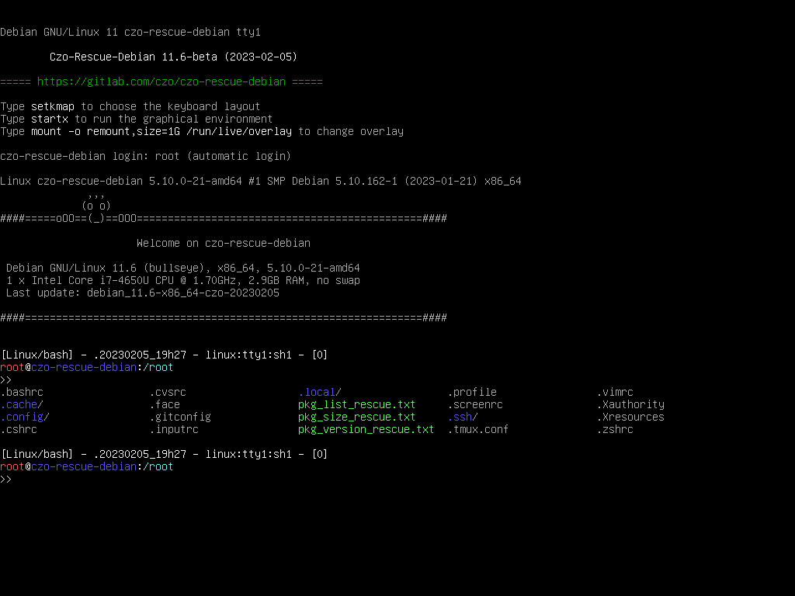
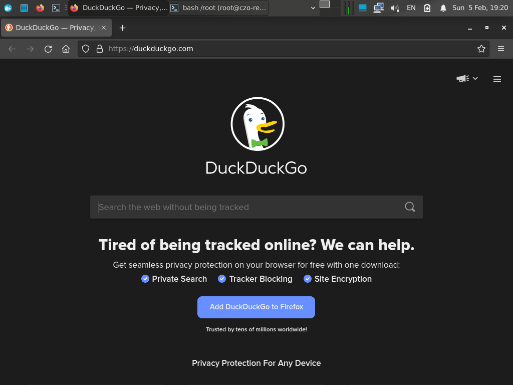
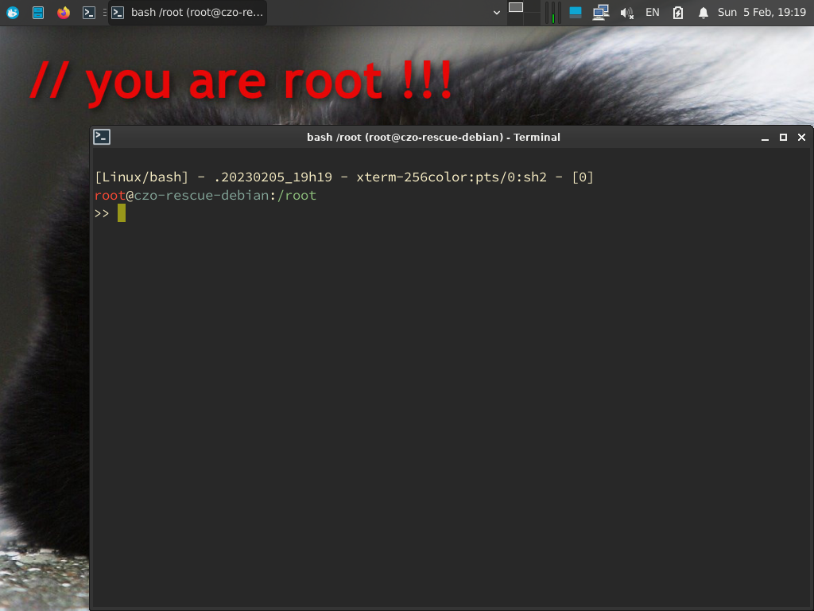
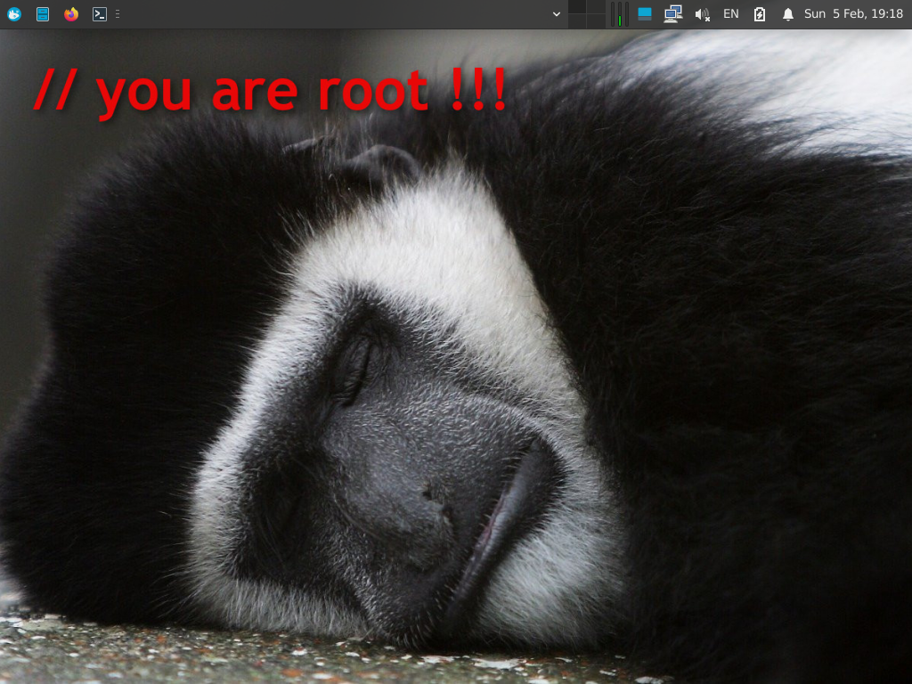

<!--
// Filename: README.md
// Author: Olivier Sirol <czo@free.fr>
// License: GPL-2.0 (http://www.gnu.org/copyleft)
// File Created: 30 December 2022
// Last Modified: Sunday 05 April 2026, 12:12
// Edit Time: 3:11:09
// Description:
//
//          Readme for Czo Rescue Debian
//
// Copyright: (C) 2022-2026 Olivier Sirol <czo@free.fr>
-->

# Czo Rescue Debian

A live [Debian-based rescue Linux distribution](https://gitlab.com/czo/czo-rescue-debian), originally derived from my own [Arch Linux SystemRescue fork](https://gitlab.com/czo/czo-system-rescue). It is designed for system administration, repair, and data recovery.

It includes ZFS binaries, 3ware RAID support, and my configuration files (.bashrc, .vimrc, and .tmux.conf).

Xfce includes the Whisker Menu and the xfce4-xkb plugin. Firefox/140.9.0esr and uBlock Origin are also included.

Version 13.4-1 (Trixie) includes kernel/6.12.74+deb13+1-amd64 and zfs/2.3.2-2.

No firewall is enabled, and the root password is `toor`.

## Project

* License: GPL-2.0 (http://www.gnu.org/copyleft)

* Source code: https://gitlab.com/czo/czo-rescue-debian

* ISO files: https://sourceforge.net/projects/czo-rescue-debian

## Building Czo-Rescue-Debian

Czo-Rescue-Debian can be built for x86\_64 architecture.
It must be built on Debian 13 amd64.

The following packages must be installed on the build system:

```
apt install syslinux-efi grub-pc-bin grub-efi-amd64-bin grub-efi-ia32-bin isolinux mtools dosfstools bash coreutils debootstrap squashfs-tools libarchive-tools xorriso isomd5sum
```

The build process can be started by running the `make-czo-rescue-debian-iso` script.

You can also build it in Docker. Just run `make`.

This will create a large `build-czo-rescue` subdirectory, and the ISO file will be placed there if all goes well.

## Log Files

At the root of the ISO, you can find:

* build-czo-rescue.log: this file contains the log output of the `make-czo-rescue-debian-iso` command.

* build-czo-rescue.packages: this file lists the name, version, and size of each package in Czo Rescue Debian.

## Modifying the Czo-Rescue-Debian ISO

If you do not want to rebuild Czo-Rescue-Debian from scratch, you can modify the live image directly. This must be done as root.

```
( mkdir czo-rescue-debian-13.4-1 && bsdtar -C czo-rescue-debian-13.4-1 -xf czo-rescue-debian-13.4-1.iso && unsquashfs czo-rescue-debian-13.4-1/live/filesystem.squashfs )
```

Then make your changes: remove my dotfiles if needed ( yes, there are too many aliases :-), configure .ssh/authorized\_keys, adjust grub.cfg and isolinux.cfg, and so on. Then run:

```
( cd czo-rescue-debian-13.4-1/live && rm filesystem.squashfs; mksquashfs ../../squashfs-root filesystem.squashfs -comp xz -Xbcj x86 -b 512k -Xdict-size 512k && sha512sum filesystem.squashfs > filesystem.squashfs.sha512 && cd .. && ./mkiso )
```

## Screenshots

czo-rescue-debian-console:



czo-rescue-debian-firefox:



czo-rescue-debian-terminal:



czo-rescue-debian:



